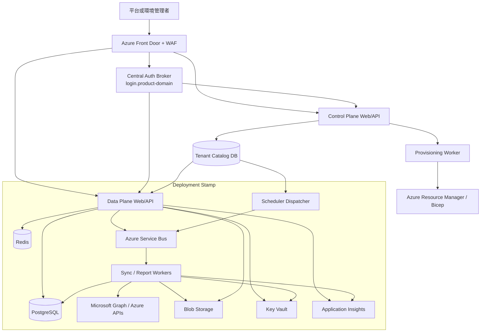
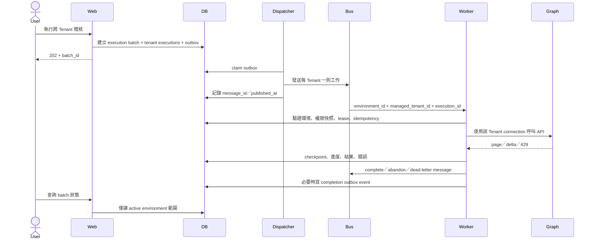

# 02 — V2+ 目標架構

## 1. 架構原則

1. Control Plane 不直接查詢客戶業務資料。
2. `ManagementEnvironment` 是客戶資料、設定、稽核、配額、備份與刪除的第一隔離邊界。
3. `ManagedTenant` 是 Microsoft API 呼叫、同步 checkpoint、節流與工作執行的最小邊界。
4. Web 無狀態；所有長工作由 queue 與 Worker 處理。
5. 同一版映像支援共享與專屬環境，不為客戶維護長期分支。
6. PostgreSQL RLS、私有 Blob container 存取與 Key Vault 邊界採 fail-closed；Blob prefix 只作組織方式，不視為安全邊界。

## 2. 邏輯架構

## 3. 元件責任

| 元件 | 責任 | 禁止事項 |
|---|---|---|
| Central Auth Broker | 固定 Entra callback、token 驗證、一次性 Environment handoff、global logout／revoke 協調 | 不共享跨子網域 Domain cookie，不依 email／UPN 自動綁帳號 |
| Control Plane | 環境生命週期、方案、Stamp placement、網域、部署工作 | 不查客戶 Graph 快取、報表內容或事件明細 |
| Tenant Catalog | 環境 metadata、位置、狀態、entitlement、資源 reference | 不存 Microsoft access token |
| Data Plane Web/API | 登入、環境切換、RBAC、查詢、動作 enqueue、下載授權 | 不在 request thread 執行完整同步 |
| Scheduler Dispatcher | 找出到期工作、產生 execution/outbox、enqueue | 不直接呼叫 Graph |
| Worker | 取得 TenantContext、Token、呼叫 Microsoft API、寫 checkpoint／結果 | 不信任訊息內的 secret 或任意 endpoint |
| PostgreSQL | metadata、工作狀態、Microsoft 快取、RLS | 應用帳號不得是 table owner 或具 BYPASSRLS |
| Service Bus | durable work、重試、dead-letter、back pressure | 訊息不得含 token、secret、PII payload |
| Redis | OAuth state、短期 cache、分散式鎖／節流 | 不作永久真實來源 |
| Blob Storage／Storage Broker | 私有 container 內的報表、匯入／匯出、稽核 anchor、封存；集中檢查 object scope | 不以 prefix 取代授權，不以原始使用者檔名作 object key |
| Key Vault | 憑證、金鑰、客戶自帶憑證 reference | 不存一般組態與業務資料 |
| App Insights | trace、metric、結構化 log、SLO | 不記錄 token、完整 UPN、raw evidence |

## 4. 隔離方案

| 模式 | Compute | Database | Storage／Key | 適用 |
|---|---|---|---|---|
| `pooled` | 共享 Stamp | 共享 DB，`environment_id` + RLS | 共享 Storage account、每 Environment 私有 container；每環境 key scope | MVP／標準方案 |
| `dedicated_db` | 共享 Stamp | 每環境獨立 DB | 每環境 container／key | 高資料隔離、獨立還原 |
| `dedicated_stamp` | 獨立 Stamp | 獨立 server／DB | 獨立 Storage／Key Vault | 法遵、區域、效能或企業方案 |

建議先完成 `pooled` 的完整邏輯隔離與 RLS，再以相同 repository 介面支援 `dedicated_db`。`dedicated_stamp` 由 Control Plane 與 IaC 自動建立。

## 5. Environment 解析與路由

- 中央登入／callback：`login.<product-domain>`；Login App 只登錄固定 callback，不為每個 Environment 動態增加 redirect URI。
- 平台管理入口：`admin.<product-domain>`，只提供 Control Plane 功能。
- 客戶環境入口：`<environment-slug>.<region>.<product-domain>`。
- Front Door 將 hostname 路由至正確 Stamp；Data Plane 再以已驗證 host 查本地同步的 Catalog／Environment projection。
- Auth Broker 完成登入後產生一次性、短效且綁定 target host／Environment／Principal／nonce 的 handoff；目標 host consume 後建立自己的 host-only signed session cookie 與 DB active-session registry。
- Control Plane 與每個 Environment 不共享 Domain cookie；切換環境需經 Auth Broker 建立新的 host session，登出／撤銷則更新中央與各環境 active-session registry。
- Session 綁定 active environment 與 membership version；每次敏感操作重新驗證 membership version。
- 不接受客戶端 header 自行指定 environment；內部反向代理 header 必須由可信 proxy 覆寫並清除外來值。
- Data Plane origin 僅允許 Front Door Private Link／access restriction；驗證 Front Door instance／來源，direct-origin 或未登錄 Host 一律拒絕。Catalog 對 canonical／custom host 維持 verified-domain unique constraint。
- 自訂網域為後續能力，啟用前必須驗證 DNS ownership 並防止 dangling domain。
- Data Plane 使用本地 Environment projection 與 bounded cache，不在每個 request 跨區讀 Catalog；projection 過期時一般讀取可依 ADR 降級，登入、membership 變更與高風險操作 fail-closed。

參考：[Azure Front Door 多租戶指引](https://learn.microsoft.com/en-us/azure/architecture/guide/multitenant/service/front-door)、[多租戶網域名稱考量](https://learn.microsoft.com/en-us/azure/architecture/guide/multitenant/considerations/domain-names)。

## 6. 工作執行流程

工作語意採 at-least-once，因此每個 handler 必須冪等。排程 occurrence key 使用 `job_definition_id + target + scheduled_at + version`；訊息 delivery／handler step 使用 `tenant_execution_id + step + checkpoint`。人工執行一律有新的 operation UUID，不會被同時間窗的另一次合法執行誤合併。

## 7. 建議 Azure 服務基線

- Azure Front Door Premium + WAF
- Azure Container Apps：Control Plane、Data Plane Web、Dispatcher、Worker、migration job
- Azure Database for PostgreSQL Flexible Server
- Azure Service Bus
- Azure Managed Redis 或相容受管 Redis
- Azure Blob Storage
- Azure Key Vault
- Azure App Configuration（非機密功能旗標與平台預設）
- Azure Monitor、Application Insights、Log Analytics
- Bicep 作為 IaC；若組織已有 Terraform 標準可等價替換

Container Apps 是建議基線，不是業務契約。程式維持標準容器、PostgreSQL 與 AMQP／queue 介面，保留移轉能力。

## 8. 非功能初始目標

| 項目 | MVP 目標 | GA 前需定案 |
|---|---|---|
| 可用性 | 單區多 replica；queue 可重送 | SLA、跨區策略 |
| RPO | PostgreSQL PITR 與 Blob versioning | 依方案分級 |
| RTO | IaC 可重建 Stamp，文件化還原 | 演練後數值 |
| 擴充 | Web／Worker 可獨立水平擴充 | 每 Stamp 容量模型 |
| 併發 | 每環境／Tenant／Graph resource 配額 | 方案 entitlement |
| 資料駐留 | Customer Content／Environment audit 固定 region | Identity、Catalog metadata、telemetry、backup 各自定義區域與合約揭露 |
| 更新 | canary → standard → dedicated rings | 客戶維護窗口 |
