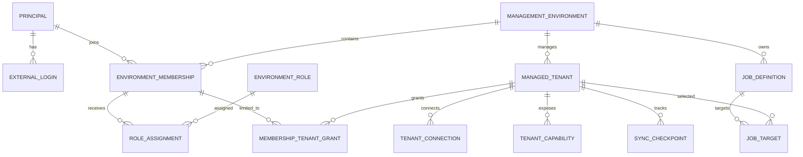

# 03 — 多環境、身分、授權與資料模型

## 1. 固定名詞

| 名詞 | 定義 |
|---|---|
| Platform | SaaS 提供者整體控制域 |
| Management Environment | 一個客戶的獨立管理環境；簡稱 Environment |
| Managed Tenant | 被該 Environment 管理的 Entra Tenant |
| Principal | 可登入平台的人員身分 |
| Membership | Principal 在 Environment 內的資格與狀態 |
| Tenant Grant | Membership 可管理的 Managed Tenant 範圍 |
| Deployment Stamp | 承載一或多個 Environment 的 Azure 資源單元 |

文件與程式禁止用單一 `tenant_id` 同時表示 Environment 與 Entra Tenant；欄位統一使用 `environment_id`、`managed_tenant_id`、`entra_tenant_id`。

## 2. 建議領域模型



## 3. 核心資料表草案

### Control Plane

| Table | 關鍵欄位／約束 |
|---|---|
| `principals` | `id UUID`, display metadata, status；Principal 為全域識別，Membership／角色才是 Environment 範圍 |
| `external_logins` | `principal_id`, `canonical_issuer`, `subject`, `issuer_tenant_id`, `object_id`, `home_account_id`; unique `(canonical_issuer, subject)` |
| `platform_local_logins` | 平台本地 break-glass credential；normalized username 全域 unique，沿用現行密碼安全機制 |
| `management_environments` | `id`, `slug`, `name`, `status`, `region`, `isolation_mode`, `stamp_id`, `plan_id`, `membership_version` |
| `principal_environment_index` | 只供登入後列出可選環境與路由至 Stamp；不是授權真實來源 |
| `managed_tenant_claims` | `entra_cloud`, `entra_tenant_id`, owning environment, status；active claim 全域唯一，例外共享須另有核准、到期與 audit |
| `platform_role_assignments` | 僅 Control Plane 權限；不得隱含客戶資料讀取 |
| `plans`／`environment_entitlements` | Tenant／使用者／工作併發／保留期／功能上限；與 RBAC 分離 |
| `provisioning_operations` | 環境建立、移動、暫停、刪除的 durable state machine |

### Data Plane

| Table | 關鍵欄位／約束 |
|---|---|
| `managed_tenants` | `id`, `environment_id`, `entra_tenant_id`, cloud, domain, status, consent status; unique `(environment_id, entra_tenant_id)` |
| `tenant_connections` | auth mode, client ID, `credential_ref`, credential version／expiry；DB 不存 secret |
| `tenant_capabilities` | 實際 Graph permission、consent state、checked time；UI 依 capability gating |
| `environment_memberships` | `environment_id`, `principal_id`, `status`, `all_managed_tenants`, `version`; unique `(environment_id, principal_id)`；Environment 授權真實來源 |
| `environment_local_logins` | 僅在 D-03 決定允許時建立；unique `(environment_id, normalized_username)`，credential 不放在 Principal |
| `environment_roles` | `environment_id`, code；unique `(environment_id, code)` |
| `role_permissions`／`role_assignments` | 角色與 membership 範圍；平台角色不可混用 |
| `membership_permission_grants` | 保留現行 direct grant 的環境化版本；具 permission、expiry、reason、approver，預設不鼓勵使用 |
| `membership_tenant_grants` | membership 可管理的 Tenant subset |
| `environment_config` | 環境設定，不含 secret |
| `managed_tenant_config` | 單一受管 Tenant override，不含 secret |
| `job_definitions`／`job_targets` | 工作定義與每 Tenant 目標拆開 |
| `execution_batches`／`tenant_executions` | 跨 Tenant fan-out 與每 Tenant 獨立結果 |
| `sync_checkpoints` | resource type、delta link／cursor、watermark、schema version；敏感值加密 |

## 4. 現行資料模型改造

- `User.entra_object_id` 不得再單欄全域 unique；改由 `external_logins` 識別。
- `UserRole`、`RolePermission`、`UserPermission` 改由 Environment membership 與 environment role 管理。
- `super_admin` 改為 `platform_operator`；只可管理生命週期。進入客戶環境須 JIT 授權、理由、到期、客戶核准與 audit。
- `SystemConfig` 拆為平台預設、Environment 設定、Managed Tenant 設定。
- `ModuleConfig`、Task、Schedule、Execution、Report、AuditLog、SystemLog 均加入 `environment_id`。
- Microsoft 快取、checkpoint、結果資料均加入 `managed_tenant_id`。
- Teams、SharePoint、SignIn、Defender、Intune 等遠端 ID 使用 unique `(managed_tenant_id, source_object_id)`。
- 報表只保存 Blob object key，不保存本機絕對路徑。

## 5. Control／Data Plane 授權一致性

- Principal 與 external login 由共享 Identity／Control Plane 管理；Environment membership、角色與 Tenant grants 由該 Environment 所在 Data Plane 管理。
- Control Plane 的 `principal_environment_index` 僅供環境探索與 Stamp routing；每次進入 Environment 仍由 Data Plane 重新驗證 authoritative membership。
- Membership／role／grant 變更以 outbox event 更新索引、撤銷相關 session 並遞增 membership version。
- Data Plane 不在每個 request 同步呼叫 Control Plane；短暫 Control Plane 故障不應中斷已驗證環境的讀取，但敏感操作仍檢查本地最新 membership version。
- MVP 可部署在同一 PostgreSQL server 的不同 schema；介面與 migration 必須保持日後分離 Catalog DB 與 Stamp DB 的能力。
- Dedicated DB 不建立跨資料庫 FK。Data Plane 保存 `environment_projection` 與 `principal_id` reference，provisioning／outbox consumer 驗證存在性與版本；缺 projection 或版本落後時授權 fail-closed。

## 6. Request TenantContext

每次 request 在進入 route 前建立不可變 context：

```text
TenantContext
  principal_id
  environment_id
  membership_id
  allowed_managed_tenant_ids
  active_managed_tenant_id | null  # Tenant 選擇／Environment 管理頁可為 null；業務模組必填
  permission_codes
  correlation_id
```

解析順序：可信 host → Environment 狀態 → authenticated Principal → active Membership → membership version／session → Tenant Grant。任何一步失敗即 404 或 403，不退回全域查詢。

使用者登入並進入 Environment 後，必須由伺服器端 session 鎖定**單一** `active_managed_tenant_id` 才能進入任何客戶資料模組。功能頁不得從 query string、form 或 header 臨時覆寫 Tenant；切換 Environment、登出、membership version 失效時一律清除目前 Tenant。若要管理另一個 Tenant，必須回到 Tenant 選擇頁重新切換。一般管理清單禁止以 `active_managed_tenant_id=null` 查詢全 Tenant；跨 Tenant 彙總只能由獨立報表／批次流程顯式驗證完整 grants 後執行。

授權判斷固定為：

```text
principal + environment + managed_tenant(required for customer data) + permission + object
```

只具 `*.export` 或 `*.manage` 權限者的入口可見性仍沿用現有 OR gating；動作端點維持窄權限。

## 7. PostgreSQL RLS

所有 pooled 業務表：

1. `environment_id UUID NOT NULL`。
2. Managed Tenant 資料再加 `managed_tenant_id UUID NOT NULL`。
3. transaction 開始後以參數化 `set_config(..., true)` 設定 transaction-local `app.environment_id`、`app.membership_id` 或單一 `app.managed_tenant_id`。
4. 啟用 `ENABLE ROW LEVEL SECURITY` 與 `FORCE ROW LEVEL SECURITY`。
5. policy 同時限制 `USING` 與 `WITH CHECK`。
6. 應用 DB role 不得擁有表、不得 `BYPASSRLS`。
7. 無 tenant context 時採 default deny；平台 maintenance 使用獨立短效角色與完整 audit。
8. Connection pool check-in／checkout 必須驗證 context 不殘留。

RLS 採兩層：Environment policy 是所有 pooled 資料表不可繞過的基線；Managed Tenant 資料表另以 DB 內的 membership grant／all-tenant flag 限制 Web，Worker transaction 則只允許 execution 綁定的單一 `managed_tenant_id`。不把大型 allowed-ID list 塞入 session variable。

| DB role | Scope |
|---|---|
| Web app role | Environment RLS + membership／Tenant grant policy；讀寫均套 `WITH CHECK` |
| Worker role | Environment + 單一 execution／Managed Tenant；不得跨 Tenant aggregate |
| Dispatcher role | 只讀 job metadata／outbox，不讀 Microsoft customer content |
| JIT support role | 與核准 membership／Tenant grants 相同，具 expiry 與 audit |
| Migration role | 專用短效高權限；只在受控 migration job 使用，不供 Web／Worker |

RLS 是第二道防線，repository 仍須明確要求 TenantContext，方便審查、索引使用與 dedicated DB 模式相容。

參考：[Azure Database for PostgreSQL Row-level security](https://learn.microsoft.com/en-us/azure/postgresql/security/security-access-control)。

## 8. 檔案與快取隔離

- 每 Environment 使用私有 container；object key 可使用 `tenant/{managed_tenant_uuid}/{resource_type}/{random_uuid}`。Prefix 只作組織與查找，不是 RBAC 安全邊界。
- Environment 級報表可使用 container 內的 `aggregate/...`，但產生前驗證跨 Tenant grant。
- 檔名只放 metadata，下載時以 Content-Disposition 安全輸出。
- 敏感報表預設由 Data Plane／Storage Broker 每次驗權後 proxy stream。大型檔案若改簽發 SAS，只能使用極短效、單一 blob、read-only user-delegation SAS；SAS 是到期前可重用的 bearer capability，不宣稱一次性。
- Pooled Stamp 的 shared identity 仍可能有跨 container 技術權限，必須由 Storage Broker、object authorization 與 audit 防護；dedicated 模式才使用獨立 Storage account／identity 作實體邊界。
- Redis 使用 typed namespace：平台 auth state 帶 platform／flow scope、Environment session/cache 帶 environment scope、Microsoft cache 帶 environment + managed tenant scope；不得用空 Tenant 值冒充，也不得只用 Graph object ID。
- Cache entry 包含 schema version、connection version 與 permission snapshot，撤銷 consent 後可整批失效。

## 9. Environment／Tenant 生命週期

| 狀態 | 行為 |
|---|---|
| `provisioning` | 不可登入；建立資源與 baseline roles |
| `active` | 可登入與執行工作 |
| `suspended` | 撤銷 session、停止 enqueue、保留資料 |
| `offboarding` | 停止寫入，產生客戶匯出與刪除工作 |
| `deleted` | 依 retention 清除 data／blob／key，Control Plane 保留最小合規 metadata |

Tenant onboarding operation 使用 `requested → validating_environment → consent_pending → validating_consent → provisioning → completed/failed`；持久的 connection state 只使用 `pending`、`active`、`degraded`、`revoked`、`disconnected`，兩者不得混為同一欄位。

預設全域 ownership claim 下，撤銷同意只停用該 Managed Tenant。若核准跨 Environment 共享同一 Entra connection，consent／health／revocation 是共用狀態，撤銷將連動所有 assignment，UI 與 audit 必須明示。
