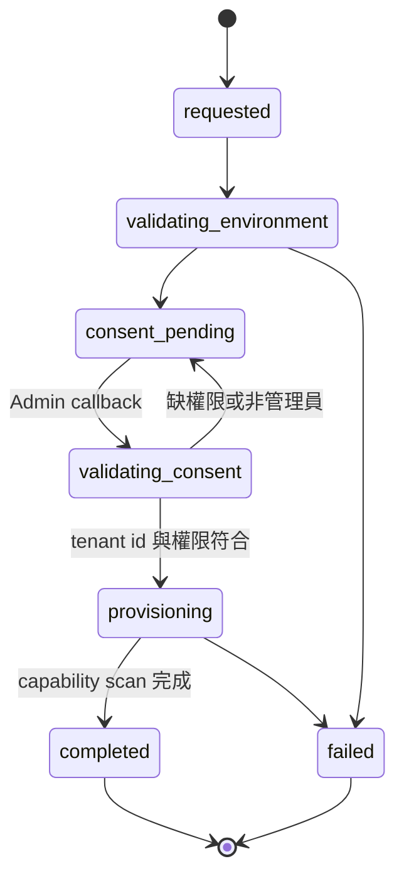

# 04 — Microsoft 連線、Admin Consent 與同步設計

## 1. App Registration 分離

V2+ 至少使用兩個安全邊界：

| App | 用途 | 權限型態 | 原則 |
|---|---|---|---|
| Platform Login App | 系統管理者／經核准 Environment 使用者 Entra SSO | Delegated：`openid profile email User.Read` | 多租戶登入 App、固定中央 callback；不授予高權限 Graph application permissions |
| Tenant Management Apps | 背景讀取受管 Tenant | Application permissions | 依 Core／Intune／Collaboration／Security 等 permission bundle 分成少量多租戶 App；Admin Consent、憑證／federation |

現行 `azure_tenant_id/client_id/client_secret` 同時供 SSO 與 Graph 使用的模型不得帶入 SaaS。

## 2. 受管 Tenant 連線模式

| 模式 | 說明 | 優點 | 代價 | 建議 |
|---|---|---|---|---|
| Provider-owned app bundles | SaaS Provider 維護少量、版本化的多租戶 Management Apps；客戶只同意啟用的 bundle | 真正縮小授權 union、onboarding 可控 | 多 service principal、憑證與 re-consent 營運較複雜 | 標準方案首選 |
| Customer BYO app | 客戶在自己 Tenant 建 App，V2+ 保存 credential reference | 客戶控制權與隔離較高 | onboarding、輪替與支援成本高 | 企業／受監管方案 |
| 雙模式 | 依 Environment 選擇 | 商業彈性最高 | 實作與測試矩陣增加 | 目標方案，MVP 可先一種 |

Production 不使用 client secret。優先順序：Managed Identity 作 federated credential → 憑證 + Key Vault；client secret 僅限本機開發且具短效期。Microsoft 亦建議 production confidential client 優先使用憑證或 federated credential：[App credentials guidance](https://learn.microsoft.com/en-us/entra/identity-platform/how-to-add-credentials)、[Secretless authentication](https://learn.microsoft.com/en-us/entra/identity/managed-identities-azure-resources/secretless-authentication)。

單一 App 的 admin consent 會同意該 App 設定的 Application permission union；UI capability gating 不會縮小已授權權限。因此 V2+ 不宣稱「一個超級 App 可做到 capability 級最小權限」。每個 bundle 有 immutable version；新增 permission 時建立新 version／re-consent 狀態，未重新同意的 Tenant 維持舊 capability，不可靜默升權。

## 3. Platform Login Federation

- Login App 使用固定 `login.<product-domain>` callback；各 Environment host 不逐一登錄 redirect URI。
- Auth Broker 驗證 token signature、audience、canonical issuer、`tid`、`sub`／`oid`、nonce、state、時間與 authorization code flow；只接受 allowlisted Microsoft authority／cloud。
- Environment 必須先核准可登入的 issuer Tenant，且使用者需有預先邀請、既有 Membership 或明確 JIT policy，才可建立／綁定 Principal。
- External identity canonical key 固定為 `(canonical_issuer, subject)`；另存 `issuer_tenant_id`、`object_id`、`home_account_id` 供稽核與 guest 判斷。
- 禁止依 email、UPN 或 display name 自動合併帳號；guest／home identity linking 必須由已驗證流程顯式核准並 audit。
- Auth Broker 完成驗證後簽發一次性、短效、綁定目標 host／Environment 的 handoff；目標 Data Plane consume 後才建立 host-only session。切換環境需重新 handoff，不共享跨子網域 cookie。

## 4. Admin Consent onboarding



上圖只描述 onboarding operation。Managed Tenant connection 另用 `pending／active／degraded／revoked／disconnected` 持久狀態；re-consent 建立新的 onboarding operation，不把兩種 state machine 寫在同一欄位。

流程要求：

1. Environment admin 先登入 V2+ 並發起「新增 Managed Tenant」。
2. 產生一次性、短效、server-side state，綁定 environment、requester、return URL 與 nonce。
3. 導向特定 Tenant 的 Admin Consent endpoint；不使用未驗證的 `common` 作 ownership 證明。
4. Callback 驗證 state、Tenant ID、操作者資格與預期環境。
5. 以 organization／service principal 查詢確認實際 Tenant，建立 `managed_tenants`。
6. 執行 capability scan；記錄已同意與缺少的 permission，不以「token 取得成功」代表功能皆可用。
7. 只有完成最低 capability set 才進 `active`。

同一 Entra Tenant 預設只能指派給一個 Management Environment；Control Plane 以 `managed_tenant_claims` 強制全域 active claim 唯一。跨環境重複納管須建立具核准人、原因、範圍與到期日的共享例外，不可只依 Data Plane 的 environment-local unique constraint。

官方流程：[Microsoft identity platform Admin Consent](https://learn.microsoft.com/en-us/entra/identity-platform/v2-admin-consent)、[Convert app to multitenant](https://learn.microsoft.com/en-us/entra/identity-platform/howto-convert-app-to-be-multi-tenant)。

## 5. Capability 與最小權限

不要維護一份「全產品超級權限」。每個 capability 對應一個 permission bundle／version，並定義必要與選用權限；Tenant 只連線需要的 bundles。

| Capability | 初始 Application permissions 基線 | 備註 |
|---|---|---|
| Entra accounts／license／MFA | `User.Read.All`, `Group.Read.All`, `Directory.Read.All`, `UserAuthenticationMethod.Read.All` | 依實際 endpoint 再縮減 |
| Sign-in logs | `AuditLog.Read.All` | 受 Microsoft 授權與保留期限制 |
| Intune devices／apps | `DeviceManagementManagedDevices.Read.All`, `DeviceManagementApps.Read.All` | 功能未啟用則不要求 |
| Teams governance | 現行 README 所列 Teams／Group／Files／Sites read permissions | 快速與完整同步分 capability |
| SharePoint governance | `Sites.Read.All`, `Reports.Read.All`, `Files.Read.All`, `GroupMember.Read.All`, `User.Read.All` | 額外掃描另行 consent |
| Defender alerts | `SecurityAlert.Read.All` | Microsoft Security 模組 |

最終清單必須以實際 Graph endpoint 對照官方 permissions reference 建 ADR；本表是現況遷移基線，不是永久授權契約。Bundle 新增權限時需新版、管理者 re-consent、差異畫面、回復舊版與 audit。

## 6. Tenant-aware Token Broker

所有 service 不再呼叫 `graph_token_manager_from_settings()`，改接收 `TenantContext` 與 `ConnectionProfile`：

```text
GraphClientFactory.for_tenant(
  environment_id,
  managed_tenant_id,
  resource="graph",
  required_capability="teams.basic"
)
```

Token cache key 至少包含：

```text
credential_profile_id + credential_version + entra_tenant_id
+ authority_cloud + resource_audience + normalized_scope_hash
```

- Cache key 不包含 client secret 或憑證內容。
- Token 不寫一般 DB、log 或 queue。
- Azure Public／GCC／China 的 authority、Graph endpoint、audience 以受控 enum 成組映射，禁止任意 URL。
- Credential version 更新時立即失效相關 token cache。
- Key Vault 只允許 Worker identity 讀取 Graph credential；Web 預設無權讀取。

## 7. 同步與 Graph 配額

- 每個 Managed Tenant 有獨立 checkpoint、concurrency、rate limiter 與 circuit breaker。
- 支援的資源優先使用 delta query；高頻變更且 Graph 支援時評估 change notifications。
- 429 必須遵守 `Retry-After`；沒有 header 才使用 exponential backoff + jitter。
- JSON batch 內每個 subrequest 獨立判定 429 與重試。
- 權限撤銷、credential 過期是永久／半永久錯誤：Tenant connection 轉 `degraded` 或 `revoked`，停止無限重試並通知環境管理者。
- 訊息超過重試策略後進 DLQ；人工 replay 仍使用相同 idempotency key。
- `deltaLink`／cursor 可能包含敏感 state，需加密保存且不得輸出到 UI／log。

參考：[Graph throttling](https://learn.microsoft.com/en-us/graph/throttling)、[Delta query](https://learn.microsoft.com/en-gb/graph/delta-query-overview)、[Change notifications](https://learn.microsoft.com/en-us/graph/change-notifications-overview)。

## 8. 多 Tenant 工作 fan-out

Environment 層工作只負責產生 batch；每個 Managed Tenant 建立獨立 child execution：

- 單一 Tenant 失敗不回滾其他 Tenant。
- batch summary 明確標示 completed、partial、failed、cancelled。
- 取消先停止未開始工作，執行中 Worker 在安全 checkpoint 協作取消。
- 每 Tenant 結果、錯誤、Graph request-id 與用量分開保存。
- 跨 Tenant 報表只有具 `all_managed_tenants` 或完整 grants 的會員可產生與下載。
