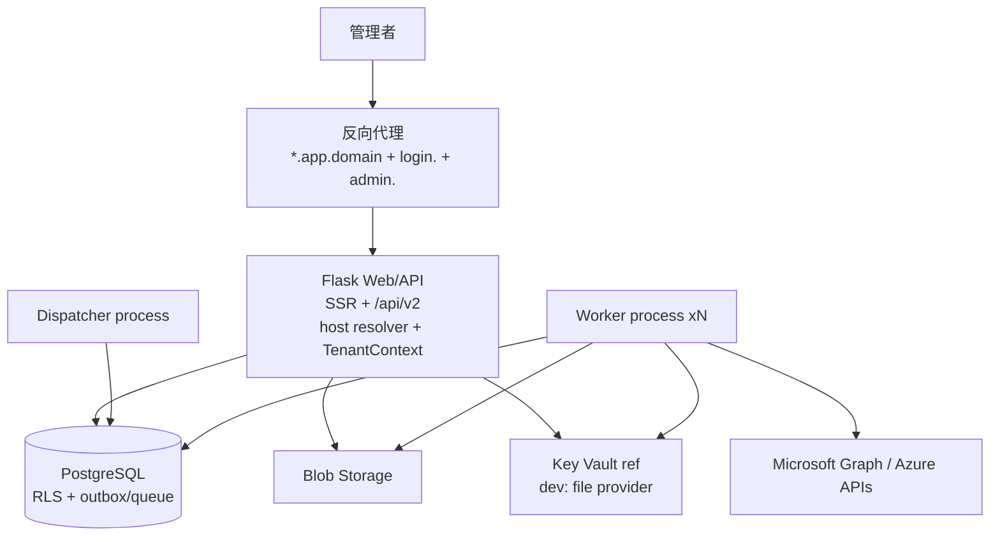

# 11 — V2+ 最終開發架構（Final）

> 文件狀態：Final Draft（審查整合版）
> 基線日期：2026-07-10（UTC+8）
> 定位：整合 01–10 文件審查結論、可行性評估、FastAPI 重構評估與修正建議；與 01–10 衝突時以本文件為準，核准後應回寫對應章節與 08 決策紀錄。

---

## 1. 審查結論總覽

01–10 文件整體品質高、方向正確，可直接作為開發基線。核心判斷全數維持：

| 審查面向 | 結論 |
|---|---|
| Environment／Managed Tenant 雙層模型（ADR-001） | ✅ 維持。名詞紀律（`environment_id`／`managed_tenant_id`／`entra_tenant_id`）是正確且必要的 |
| 不一次性重寫框架（ADR-003） | ✅ 維持，並於本文件 §4 以 FastAPI 具體評估佐證 |
| RLS + scoped repository 雙防線（ADR-005） | ✅ 維持。fail-closed、`FORCE RLS`、非 owner app role 均正確 |
| Login App 與 Management App bundles 分離（ADR-004） | ✅ 維持。bundle immutable version + re-consent 設計正確 |
| Legacy audit chain 凍結不重 hash | ✅ 維持。是稽核鏈遷移的唯一安全做法 |
| 遷移採 write-freeze cutover、不假設 CDC | ✅ 維持。誠實且可執行 |

需修正或補強者共 10 項（Δ1–Δ10，見 §5），主要集中在三類：

1. **規模與資源錯配**：文件描述的是多團隊、多季的企業級 SaaS 交付（12 個 accountable 角色、9 個 Epic、16 項決策、多 ring 部署）。現實是單一維護者 + AI 協作開發。技術控制不能減，但治理流程必須精簡，且需要一個明確的 **MVP cut**（§3.2）與 **Go/No-Go gate**（§2.4）。
2. **Azure 服務前置依賴過重**：Service Bus、Redis、Front Door 在 MVP 階段可用更輕的等價物替代（PostgreSQL queue、advisory lock、單一 wildcard 網域），保留 adapter 邊界日後無痛升級（§3.3）。
3. **缺口**：前端策略未明文化、通知通道未定義、self-host 模式定位缺席、BYO app 憑證禁令過嚴、相依鎖版工具未選定（§5）。

---

## 2. 可行性評估

### 2.1 技術基礎盤點（現行程式 → V2+ 缺口）

| V2+ 需要 | 現況 | 缺口評級 |
|---|---|---|
| PostgreSQL + Alembic | ✅ 已上線（production 已 cutover） | 低 |
| SQLAlchemy 2.0 style ORM | ✅ 已使用 | 低 |
| RBAC 三層 gating、audit chain、session registry | ✅ 完整，僅資料域是全域 | 中（改域不改機制） |
| Graph client（分頁、batch、Retry-After、adaptive throttle） | ✅ `graph_client.py` 已具備 | 低（加 TenantContext 注入） |
| TenantContext／scoped repository | ❌ 不存在 | **高（P0 核心工作）** |
| RLS | ❌ 不存在 | **高（P0 核心工作）** |
| Token broker（多 tenant、多 credential） | ❌ `TokenManager` 綁單一 tenant+secret，`graph_token_manager_from_settings()` 為全域 | **高** |
| Durable queue／Worker 分離 | ❌ APScheduler + thread，process-local | **高** |
| 集中設定分層（platform→env→tenant） | ❌ `SystemConfig` 全域 | 中 |
| CI/CD、lockfile、簽章 | ❌ `requirements.txt` 全 `>=`，無 pipeline | 中（Phase 0 即做） |

結論：**現有程式是合格的起點**。認證、RBAC、audit、Graph client 的「機制」都在，V2+ 的主體工作是「資料域改造 +執行底座抽換」，不是重寫業務邏輯。約 3.95 萬行 Python 中，估計 60–70% 的 service／module 邏輯可在 Tenant 化後保留。

### 2.2 分階段可行性與風險

| Phase | 可行性 | 風險 | 單人+AI 粗估工期* | 先決條件 |
|---|---|---|---|---|
| 0 — Baseline | 高 | 低 | 1–2 週 | **dirty worktree 先整理提交、打 baseline tag（目前 50+ 檔未提交，是第一個 blocker）** |
| 1 — Microsoft-only 退場 | 高 | 低 | 2–3 週 | capability manifest；`EntraSigninCache` 先搬離 threat_intel 模型 |
| 2 — Tenancy foundation | 高 | 中 | 4–6 週 | D-01、D-03 定案；RLS spike 通過 |
| 3 — Microsoft connection | 中 | 中 | 3–4 週 | D-02 定案；**2 個非 production 測試 Tenant**（目前未確認，需先取得） |
| 4 — Durable execution | 中 | 中 | 4–6 週 | 佇列抽象定案（§3.3 可大幅降險） |
| 5 — SaaS Control Plane | 中低 | 高 | 3–4 個月 | **商業訊號確認後才啟動**（§2.4） |
| 6 — Production readiness | 中低 | 高 | 2–3 個月 | Azure 訂閱、預算、pen test 資源 |

\* 粗估僅供排序與 gate 設計，spike 後以實測校正；不作為承諾（維持 06 §7 原則）。

### 2.3 資源現實與治理精簡

10 號文件的 12 個 accountable 角色與 Phase exit 多人簽核，在單人團隊下是形式主義。修正原則：

- **技術控制一項不減**：RLS、隔離測試、idempotency、audit atomicity、負向測試全數保留為 CI gate（機器可驗證者交給機器）。
- **流程角色合併**：traceability matrix 的 Owner 欄合併為「維護者＋（如有）外部安全審查者」兩個實體；evidence 以 CI artifact＋git tag 自動產生，不做人工簽核文書。
- **Phase exit 簽核改為 checklist-driven**：每 Phase 的 exit gate 轉為可執行的驗收測試集（07 已定義），全綠即過。

### 2.4 Go/No-Go gate（本文件新增的關鍵結構）

**Phase 4 結束 = 第一個可站住的產品形態**：「單一部署、多 Environment、多 Managed Tenant」的管理主控台，可自用（MSP／集團 IT 內部多租戶管理），不需要 Control Plane、Stamp、Front Door、計費。

- **Gate A（現在）**：D-01／D-02／D-03 定案 + baseline tag + 2–3 週 spike 通過 → 啟動 Phase 0–4。
- **Gate B（Phase 4 結束）**：有付費客戶意向或明確 SaaS 商業訊號 → 啟動 Phase 5–6；否則停在「self-host / 內部多環境版」持續交付功能價值。

此 gate 讓前 4 個 Phase 的投資在「不做 SaaS」的情境下也不沉沒。

### 2.5 可行性總結論

> **有條件可行。** 條件：(1) 整理 dirty worktree 並建 baseline；(2) D-01／D-02／D-03 三項決策定案；(3) 執行 06 §7 的 2–3 週 spike 並通過驗收；(4) 核准本文件的 MVP cut（§3.2）與 Go/No-Go gate（§2.4）。四項齊備即可開 `v2plus-foundation` 分支動工。

---

## 3. 架構定案

### 3.1 決策總表（含新增）

| ID | 決策 | 狀態 |
|---|---|---|
| ADR-001～006 | 維持 08 號文件原案 | Proposed → 建議核准 |
| **ADR-007** | Web 框架策略：Flask 續用 + 框架無關 service 層 + `/api/v2` OpenAPI 化；不進行 FastAPI 全面或同進程混掛重構（詳 §4） | 本文件新增 |
| **D-17** | Phase 5 Control Plane（全新獨立服務）框架選型於 Gate B 時決策，FastAPI 為候選首選 | 本文件新增 |
| **D-18** | 產品支援 self-host single-environment 模式：同一映像、`SINGLE_ENVIRONMENT=true` 時跳過 host resolver 直入唯一 Environment，其餘隔離機制（RLS、TenantContext）照常運作 | 本文件新增 |
| **D-19** | 前端策略：SSR Jinja + 原生 JS 續用，不做 SPA 重寫；新頁面沿用現行 theme.css／模組前綴規範，並遵循 §3.5 Anti-Slop 反模板（design-taste-frontend） | 本文件新增 |
| **D-20** | 使用者在單一 Environment 內可納管多 Tenant，但互動式管理一次只鎖定一個 server-side session Tenant；功能頁不得接受參數覆寫，切換需回 Tenant 選擇頁。導覽沿用 IT Console V2 左側階層 sidebar | 2026-07-11 使用者定案 |

### 3.2 MVP cut（對 02 號文件的拓樸簡化）

| 元件 | 02 號原案 | MVP 定案 | 升級路徑 |
|---|---|---|---|
| Front Door + WAF | 必備 | **延後**：單一 wildcard 網域 `*.app.<domain>` + 反向代理（host→environment 綁定模型不變） | Front Door 於 Phase 5 掛上，程式不改 |
| Service Bus | 必備 | **PostgreSQL queue 先行**（§3.3） | adapter 抽換 |
| Redis | 必備 | **選配**：OAuth state 用 DB TTL table；分散式鎖用 PG advisory lock；hot cache 先接受 DB 查詢 | 效能實測不足時再加 |
| Auth Broker 獨立服務 | 必備 | **同進程模組**：`login.<domain>` 路由到同一 Flask app 的 auth blueprint，handoff 機制照 02 §5 實作（一次性、綁 host） | Phase 5 拆為獨立服務 |
| Control Plane 獨立服務 | 必備 | **延後至 Gate B**：MVP 以 `manage.py` CLI + 平台管理頁面覆蓋環境 CRUD | Phase 5 建立 |
| Blob Storage | 必備 | 維持（Azure Blob 或 Azurite/MinIO 相容層），報表不落本機路徑 | 不變 |
| Key Vault | 必備 | 維持（credential reference 模型從第一天就對）；本機開發用 file-based dev provider | 不變 |
| Container Apps + Bicep | 必備 | **延後至 Phase 5**；MVP 以 Docker Compose／單 VM 部署 | IaC 於 Phase 5 |

**不簡化的項目**（安全邊界一項不減）：RLS + FORCE、TenantContext fail-closed、`(canonical_issuer, subject)` 身分模型、token cache key 規約、audit chain per-environment、隔離測試零容忍。

### 3.3 佇列抽象：PostgreSQL 先行（對 EPIC-06 的修正）

定義 `JobQueue` protocol（enqueue／claim／complete／abandon／dead-letter／延遲投遞），提供兩個實作：

1. **`PgJobQueue`（MVP）**：outbox table + `SELECT ... FOR UPDATE SKIP LOCKED` claim + lease 欄位 + 重試計數 + DLQ table。與 execution schema 同 DB，claim 與狀態更新同 transaction，天然滿足 exactly-once claim。
2. **`ServiceBusJobQueue`（Phase 5）**：依 09 §6 訊息契約實作，payload／idempotency 規則兩實作共用。

理由：(a) Phase 4 不必先開 Azure 帳單與網路依賴即可交付 durable execution；(b) self-host 模式（D-18)天生需要無 Service Bus 的路徑；(c) 09 §6 的 envelope／idempotency 契約在兩實作上完全一致，不產生程式分叉。Worker、Dispatcher、lease、heartbeat、cancel 語意全部照 02／04／09 原案，只有傳輸層可抽換。

### 3.4 MVP 邏輯架構

三種 process、同一映像、以進入點區分（`web`／`dispatcher`／`worker`）。Web 無狀態即可多 replica；現行 Issue #1 的單 worker 限制在 process-local state 移除後解除。

### 3.5 前端重構風格：Anti-Slop 反模板（design-taste-frontend）

> 風格來源：[Leonxlnx/taste-skill](https://github.com/Leonxlnx/taste-skill)（v2 SKILL.md，"The Anti-Slop Frontend Framework for AI Agents"）；評測脈絡參考 [josh.hu/designcompare#taste-skill](https://josh.hu/designcompare/#taste-skill)。
>
> **適用性聲明（誠實條款）**：taste-skill §13 明確將 dashboards／dense product UI／admin panels／data tables 列為 out of scope——其行銷頁機制（hero 紀律、bento、logo wall、GSAP scrolltelling）**不適用**本產品；其技術棧（React／Tailwind／Motion）亦被 D-19（SSR Jinja + theme.css）取代。本節採納的是其**跨場景核心**：三刻度盤、AI Tells 硬禁清單、一致性鎖（Color／Shape／Theme Lock）、表單與互動狀態規則、Redesign Protocol 與 Pre-Flight 機械式自查，並轉譯為 CSS-only 等價物。核准後回寫 09 開發規約（Δ11）並納入 DoD。

**適用範圍**：V2+ 所有新頁面，以及 V2-P1 Microsoft-only 退場後保留頁面的翻修。與 CLAUDE.md Part B1（theme.css 唯一樣式檔、`var(--*)`、雙主題）疊加生效，不取代。

#### 3.5.1 三刻度盤定案（Three Dials）

依 taste-skill §1 的 Brief → Dial 推斷表，本產品訊號為 **trust-first／regulated（IT 稽核主控台）+ cockpit 資料密度**，刻度盤全產品固定，不逐頁重推：

| Dial | 定值 | 落地含義 |
|---|---|---|
| `DESIGN_VARIANCE` | **3** | 對稱網格、等寬欄位、可預測的版面；不做不對稱留白、不做 masonry |
| `MOTION_INTENSITY` | **2** | 靜態為主，僅 `:hover`／`:active`／狀態回饋；無 entrance animation、無 scroll 動效 |
| `VISUAL_DENSITY` | 清單／SOC 頁 **7**；設定／表單頁 **5** | 高密度頁：數字用 monospace/tabular、1px 分隔線、禁 generic card container（skill §4.4：density > 7 卡片容器 banned）；表單頁維持日常節奏 |

#### 3.5.2 反模板（禁止 → 改用；S1–S16）

S1–S10 為場景轉譯，S11–S16 直接繼承 taste-skill 硬禁（原文 §4／§7／§9）：

| # | 禁止（AI Slop 特徵） | 改用（taste） |
|---|---|---|
| S1 | AI 紫藍漸層、漸層按鈕、neon／outer glow、glassmorphism（THE LILA RULE） | 中性基底 + 至多 1 個強調色；色彩一律 `var(--*)` 語意變數，語意色只表達語意 |
| S2 | Emoji 當圖示、標題前綴 emoji（skill Emoji Policy：預設 discouraged） | 既有 Font Awesome 單一圖示家族（skill「one icon family per project」）；圖示必承載資訊，純裝飾省略 |
| S3 | 大圓角卡片 + 重陰影堆疊卡片牆；純黑 `#000000` 陰影 | 以 `border-t`／`divide-y` 邏輯（`--border` + `--bg-surface/--bg-elevated`）分組；陰影僅浮出層且色調貼近背景 |
| S4 | 行銷式留白 hero、三欄等寬 feature cards（skill 明禁「three identical cards」）、超大 H1 | 首屏即見資料；標題層級最多三層、字級克制 |
| S5 | Entrance animation、hover 浮起、到處 shimmer；`scroll` 事件監聽 | 動效僅狀態回饋且必須能一句話說明目的（Motion Must Be Motivated）；只動 `transform`/`opacity`；≤ 150ms；`prefers-reduced-motion` 必守；需進場偵測用 IntersectionObserver |
| S6 | 表格型資料改卡片牆、無限捲動 | 表格 + 分頁 + 穩定排序（09 §5）；欄位對齊可掃讀 |
| S7 | 裝飾性圖表、無意義 sparkline、假趨勢線 | 每張圖表回答一個明確問題；純 CSS/SVG，禁第三方圖表庫 |
| S8 | 每頁自創新色、hardcode 色碼、暖冷灰混用 | 全走 theme.css 變數；一個專案一套中性灰（skill「one palette per project」）；新色階以 `--*-soft` 變體進變數 block |
| S9 | 行銷式文案（「強大的」「一站式」「Elevate／Seamless／Next-Gen」類 filler verbs）、標題驚嘆號 | 功能性文字、名詞優先、台灣用語；出貨前 Copy Self-Audit：逐句重讀所有可見字串，砍掉 AI 腔（skill §4.9：boring copy > AI-generated cute copy） |
| S10 | 純圖示按鈕無標籤、動作藏 hover 才現 | 桌面 `.btn-sm` + 文字或 `title`；行動端 ≥ 44×44px（`.acc-touch`）；主要動作常駐可見 |
| S11 | **假精確數字**（`99.99%`、`1234567`、示意用 `92%`） | 數字來自真實資料，或明確標示 mock／範例；否則不放（skill「fake-precise numbers」ban） |
| S12 | **裝飾性彩色狀態圓點**撒滿清單／nav／badge | 狀態圓點僅用於真實狀態語意（online/degraded/revoked 等），預設零裝飾圓點 |
| S13 | **段落編號 eyebrow**（`01 / 系統`、`002 · 功能`）、垂直旋轉文字、裝飾用 hairline 十字線 | 區塊標題直接寫名詞；不加編號裝飾 |
| S14 | **em-dash（`—`）與 en-dash（`–`）作分隔或裝飾**（skill §9.G：零容忍） | 中文用全形標點（、。：）；英文 UI 字串用句號、逗號或冒號重組；範圍值用連字號（`2018-2026`） |
| S15 | **placeholder 當 label**（skill §4.6：No placeholder-as-label. Ever.） | label 在 input 上方、helper text 保留於 markup、error text 在 input 下方 |
| S16 | generic 轉圈 spinner 當所有 loading 態 | Skeleton 形狀貼合實際版面；空狀態說明「現在沒有什麼＋下一步做什麼」；錯誤 inline（表單）或 contextual（暫時性才用 toast） |

#### 3.5.3 一致性鎖與正面規則（design-taste 基線）

1. **Color Consistency Lock**：一頁選定強調色後全頁一致，出貨前逐元件 audit；強調色飽和度 < 80%。
2. **Shape Consistency Lock**：全產品一套圓角尺度（沿用 theme.css 現值），禁止「方版面裡的圓按鈕」混用；例外需成文規則。
3. **Page Theme Lock**：一頁一主題，區塊不得中途反轉明暗；本產品由 `<html data-theme>` SSR 鎖定，dark/light 皆人工目視驗收（Issue #10／#12 規範沿用）。
4. **數字排版**：數值欄 `font-variant-numeric: tabular-nums` + 右對齊；`VISUAL_DENSITY 7` 頁面數字用 monospace（`ui-monospace` 堆疊）；千分位與單位固定；KPI 卡標題一行、數值一行、輔助說明至多一行。
5. **對比可及性（WCAG AA，mandatory）**：按鈕文字對按鈕底、表單 input／placeholder／focus ring／label／error 對區塊底，皆 ≥ 4.5:1（大字 3:1）。
6. **觸覺回饋**：`:active` 用 `translateY(1px)` 或 `scale(0.98)`，不加彈跳動畫。
7. **功能性克制**：每頁 primary button 至多一顆；同一意圖的 CTA 不得出現兩種文案（skill「No Duplicate CTA Intent」）；次要動作收 dropdown 或列內 `.btn-icon`。
8. **層級由排版承擔**：先字重、字級、間距、對齊，不夠才動色彩；避免「每區塊一個彩色框」。
9. **一致優先於新意**：新頁面先抄現有最好的頁面模式（模組前綴 append 進 theme.css）；發明新模式需在 PR 說明為何既有模式不足。
10. **字體不外連**：內網／self-host 不依賴 Google Fonts CDN；維持系統字族堆疊（skill 的 Geist/Satoshi 偏好不採納——本產品屬其 override 路徑「public-sector／accessibility-first 可用中性字體」）。

#### 3.5.4 既有頁面翻修協定（Redesign Protocol，轉譯自 skill §11）

翻修模式固定為 **Redesign-Preserve**（品牌與 IA 不動，去 slop 不換皮）：

- **先盤點再動手**：記錄現況 brand tokens（theme.css 變數）、IA、保留模式（既有最好的頁面）、待退場模式（S1–S16 命中處）。
- **改良槓桿依序套用，滿足即停**：① 排版（字級/字重/對齊）→ ② 間距與節奏 → ③ 色彩收斂（去飽和、統一中性灰）→ ④ 既有元件補互動狀態 → ⑤ 區塊重組（僅無可救藥時）。
- **未經明確核准不得默改**（skill §11.F）：URL／route、導覽標籤、表單欄位名稱與順序、品牌識別、法律／同意文案。

#### 3.5.5 Pre-Flight 自查（機械式，併入 DoD）

UI 變更的 PR 出貨前逐項打勾，任一不過即未完成（skill §14 精神：**THIS IS NOT OPTIONAL**）：

- [ ] S1–S16 反模板零命中
- [ ] 三刻度盤未被逾越（無 entrance 動效、無不對稱裝飾版面、密度符合頁面類型）
- [ ] Color／Shape／Theme 三鎖通過；dark/light 雙主題目視
- [ ] 按鈕與表單 WCAG AA 對比通過；label 在上、error 在下、無 placeholder-as-label
- [ ] 可見字串 Copy Self-Audit 完成；無假精確數字；無 em/en-dash
- [ ] 每個動效可用一句話說明目的；`prefers-reduced-motion` 已處理
- [ ] 空／載入／錯誤三態齊備；loading 用貼版面 skeleton
- [ ] 未默改 URL、導覽標籤、表單欄位、品牌識別

既有頁面翻修的完成定義＝「Pre-Flight 全綠」，不追求視覺重設計；重構是**去除 slop**，不是換皮。

---

## 4. FastAPI 重構評估與決策（ADR-007）

### 4.1 現況事實基礎

- 22 個 blueprint、63 個 Jinja 模板、SSR 為主；Flask-Login（signed cookie + DB active-session registry）、Flask-WTF CSRF、`@require_permission` 裝飾器、audit hooks 深度耦合 Flask request lifecycle。
- 測試 9,400 行，多數以 `pytest-flask` client 驅動。
- Web 流量特性：內部管理主控台，低 RPS；效能瓶頸在 Graph 429 與長時同步工作——**這兩者 V2+ 已決定拆到 Worker，與 Web 框架選型完全無關**。
- 唯一 async 程式（`app_audit` 的 aiohttp prefetch）已證明：需要 async I/O 的地方可以局部採用，不需要 ASGI web 框架。

### 4.2 選項比較

| 選項 | 內容 | 成本 | 風險 | 判定 |
|---|---|---|---|---|
| A. 全面重寫 FastAPI | 22 blueprints + 63 模板 + auth/CSRF/session/RBAC 全部重建 | 數月，期間零新功能 | 極高：Flask-Login／WTF 無等價物需自建；9,400 行測試重寫；與 ADR-003 直接衝突 | ❌ 否決 |
| B. 同進程混掛（Flask WSGI mount 進 FastAPI/Starlette） | `/api/v2` 走 FastAPI，SSR 留 Flask，共用 session cookie | 中 | **高：TenantContext／授權 pipeline 變成兩套實作**。V2+ 隔離要求零容忍，雙 auth stack = 雙倍漏 filter 面積；cookie／CSRF 跨框架解析脆弱 | ❌ 否決 |
| C. 獨立服務採用（僅全新無 legacy 的服務用 FastAPI） | Control Plane（Phase 5）、未來對外 API gateway | 低（全新程式無遷移成本） | 低：與 Data Plane 無共用 session；API-first 場景正是 FastAPI 強項 | ⭕ 保留為 D-17 選項 |
| D. 維持 Flask + 定向補強 | 見 §4.3 | 低 | 低 | ✅ **採用** |

### 4.3 定案內容（選項 D + C）

1. **Web／SSR 續用 Flask**：認證、CSRF、RBAC、audit、63 個模板全數沿用；V2+ 的工作量集中在 tenancy，不花在框架搬家。
2. **`/api/v2` 在 Flask 內 OpenAPI 化**：DTO 一律 pydantic v2（框架無關）；OpenAPI 產生器（flask-smorest 或 spectree）於 Phase 2 以 ADR 擇一。維持**單一** auth／TenantContext pipeline。
3. **Worker／Dispatcher 框架無關**：無 HTTP 介面，不需要任何 web 框架。新寫的 handler 可直接用 `asyncio` + `httpx`（async Graph 呼叫、per-tenant limiter），與 Flask 零耦合——FastAPI 的 async 效益實際上由這裡取得，且不必引入 FastAPI。
4. **Control Plane（Phase 5）開放 FastAPI**（D-17）：全新程式、純 JSON API、無 SSR 包袱，屆時若啟動 SaaS 即以 FastAPI 為候選首選，作為獨立映像部署。
5. **保留未來全面遷移的能力（邊界規則，寫入 09 開發規約）**：
   - service／repository／jobs 層**禁止 import flask**（不得使用 `current_app`、`g`、`request`）；
   - `TenantContext` 為 plain dataclass，由 web 殼層建構後顯式傳入；
   - route 函式只做「解析 request → 呼叫 service → 組 response」的薄殼。
   - 遵守此邊界後，若日後決定轉 ASGI，只需替換薄殼層，成本從「重寫」降為「換殼」。

### 4.4 一句話結論

> FastAPI 解決的問題（async web I/O、自動 OpenAPI、型別 DI）在本產品的痛點清單上排不進前五；本產品的痛點（tenancy、durable jobs、隔離）FastAPI 一項也解不了。**框架不動，邊界做對**——把「可遷移性」當成規約維護，把重寫的選擇權留到真正需要時。

---

## 5. 對 01–10 文件的修正清單（Δ）

核准後由對應文件 PR 回寫：

| Δ | 對象 | 修正內容 | 優先 |
|---|---|---|---|
| Δ1 | 02 §7、EPIC-06 | 佇列抽象 PG 先行，Service Bus 移至 Phase 5（§3.3） | P0 |
| Δ2 | 02 §7 | Redis 降為 MVP 選配；OAuth state → DB TTL table、鎖 → PG advisory lock | P0 |
| Δ3 | 02 §5 | MVP 網域拓樸簡化為 wildcard + 反向代理；host→environment 綁定模型不變；Front Door／custom domain 延至 Phase 5 | P0 |
| Δ4 | 01／08 | 新增 D-18 self-host single-environment 模式；`legacy-default` Environment 即此模式的第一個使用者，遷移與產品形態合一 | P1 |
| Δ5 | 10 | 治理精簡：Owner 角色合併為實際人力，evidence 改 CI artifact 自動化（§2.3） | P1 |
| Δ6 | 05 §8 | Phase 0 立即鎖版：採 `uv`（或 pip-tools）產生 lockfile，終結 `>=` 相依 | P0 |
| Δ7 | 04 §7 | 補「通知通道」定義：per-environment 通知設定（Teams webhook 泛化 + SMTP），consent 撤銷／credential 到期／DLQ 告警走此通道 | P1 |
| Δ8 | 04 §2 | BYO app 憑證政策放寬為「憑證優先；客戶堅持 secret 時限短效 + 到期告警 + 輪替 runbook」，避免 onboarding 卡死 | P2 |
| Δ9 | 08 | 新增 D-19 前端策略明文化（SSR 續用，杜絕隱性 SPA scope creep） | P1 |
| Δ10 | 06 | V2+ 階段命名改用 `V2-P0`～`V2-P6` 前綴，避免與 repo 既有 Phase 4／6 文件（PostgreSQL 遷移）撞名 | P2 |
| Δ11 | 09 §10、CLAUDE.md B1 | 將 §3.5 Anti-Slop 反模板（design-taste-frontend，源自 Leonxlnx/taste-skill v2）回寫開發規約並納入 DoD；UI PR 需跑 §3.5.5 Pre-Flight 自查（S1–S16 + 三鎖 + 刻度盤） | P1 |

---

## 6. 新功能候選 backlog（post-MVP，不進首版範圍）

依「價值／成本」排序，全部繫上所需 Graph application permission，納管進 capability bundle 版本機制（04 §5）：

| 候選 | 說明 | 權限 | 價值/成本 |
|---|---|---|---|
| App 憑證到期看板 | 掃描各 Tenant App registrations 的 secret／cert 到期，跨 Tenant 彙總告警——MSP 剛需 | `Application.Read.All` | 高/低 |
| Conditional Access 快照與 diff 稽核 | 定期快照 CA 政策，變更差異告警與歷史回溯 | `Policy.Read.All` | 高/低 |
| Secure Score 趨勢 | 每 Tenant 安全分數趨勢與跨 Tenant 比較 | `SecurityEvents.Read.All` | 中/低 |
| 服務健康／訊息中心整合 | M365 service health 與 message center 跨 Tenant 彙總 | `ServiceHealth.Read.All`, `ServiceMessage.Read.All` | 中/低 |
| Graph change notifications | 高頻資源以 webhook 取代輪詢（04 §7 已預留） | 依資源 | 中/中 |
| 報表訂閱 | 排程報表產出後經 Δ7 通知通道投遞 | 無新增 | 中/低 |
| Access review 報表 | Entra ID Governance 存取審查結果彙總 | `AccessReview.Read.All` | 中/中 |
| 稽核鏈自助驗證工具 | 客戶可下載 anchor 與驗證器自行驗證 audit chain——信任賣點 | 無 | 中/低 |

---

## 7. 開發啟動行動清單（依序）

1. **整理 worktree**：現行 50+ 未提交修改由維護者分類提交或捨棄，打 `v2plus-baseline` tag（06 §1；目前最大 blocker）。
2. **定案三決策**：D-01（隔離方案：建議 pooled+RLS 起步）、D-02（建議 provider-owned bundles 起步）、D-03（Environment 本地帳號去留）。
3. **取得 2 個非 production 測試 Entra Tenant**（Microsoft 365 Developer Program 或 sandbox 訂閱）。
4. **執行 2–3 週 spike**（06 §7 清單，佇列項改用 §3.3 的 `PgJobQueue` 原型），以 08 §5 驗收。
5. **核准本文件**：ADR-007、D-17～D-19、MVP cut、Δ1–Δ10 回寫各文件。
6. 開 `v2plus-foundation` 分支，依修訂後 V2-P0 啟動（lockfile、CI、capability manifest 先行）。
